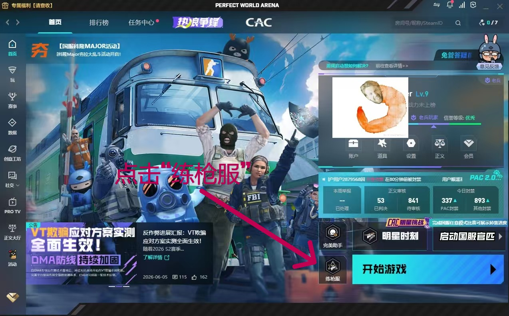
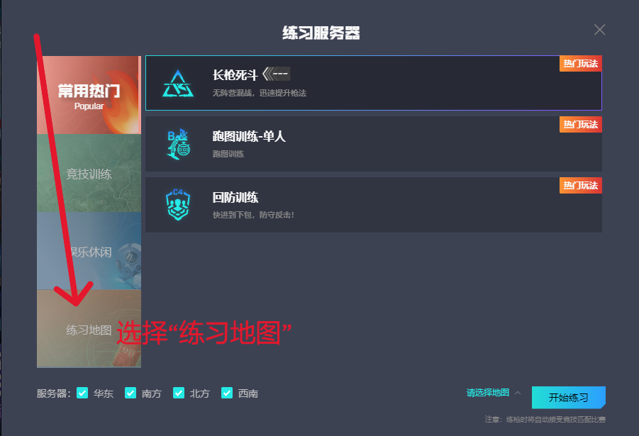
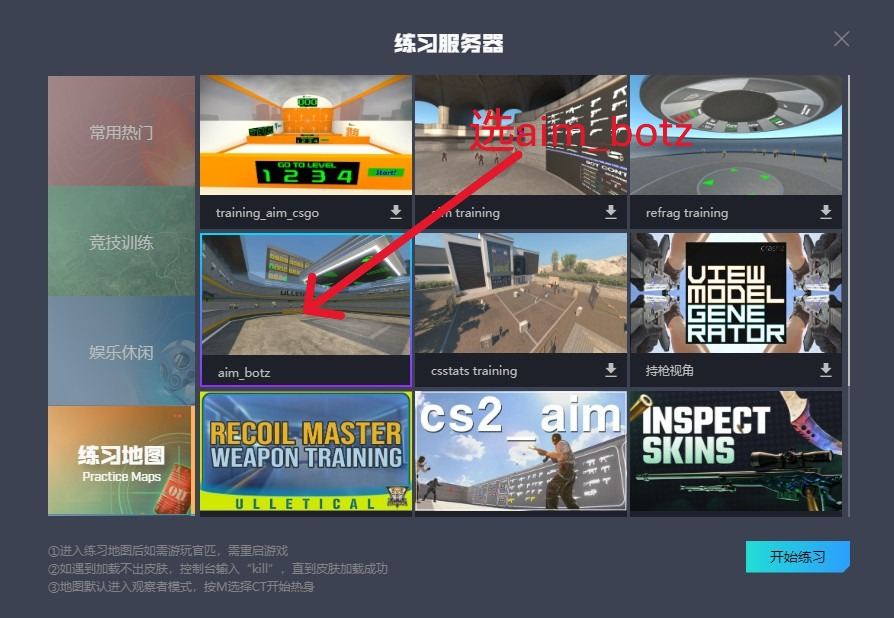

# 🎯 练枪记录器 · Aim Training Tracker

>作者每天练枪没地方记录于是做了这个网页😀


CS2 练枪数据追踪工具。记录每次训练的枪械、耗时和 KPM，自动生成分析反馈。

**[👉 直接使用](https://perryyang10.github.io/aim-tracker/)**

## 😄在哪里练枪？











## ✨ 功能

- **记录训练** — 日期时间、枪名、耗时，自动计算 KPM
- **智能分析** — 根据近期趋势、时段、枪械专注度生成多维度评价
- **历史回溯** — 按枪械筛选、按时间/KPM排序，所有记录可查
- **导出备份** — 一键导出 JSON 备份文件
- **导入恢复** — 支持备份恢复，自动去重
- **云端持久化** — 数据存 Supabase 云端，换设备/清缓存不丢失
- **霓虹 UI** — 玻璃拟态 + 像素风动态背景 + 拖拽恐怖分子

## 🚀 使用方式

直接打开 [perryyang10.github.io/aim-tracker](https://perryyang10.github.io/aim-tracker/)，开始记录即可。

数据独立存储于你的浏览器 + 云端，不同用户之间互不可见。

## 🛠 技术栈

| 层 | 方案 |
|---|------|
| 前端 | 纯 HTML/CSS/JS，零依赖 |
| 数据库 | [Supabase](https://supabase.com) PostgreSQL |
| 部署 | GitHub Pages |
| Canvas | 像素角色 + 子弹物理 + 粒子特效 |

## 📋 本地运行

```bash
# 直接打开 index.html 即可
# 或启动本地服务：
python -m http.server 8520
```

另有 Flask 后端（`CS list_prtc/server.py`）支持 SQLite 本地存储，可选使用。
